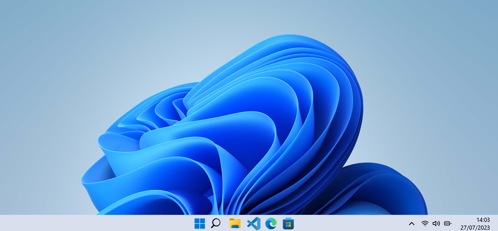

# 🖥️ Windows - ReactJS

---

Bem-vindo ao meu projeto de recriação da interface do **Windows**! Desenvolvi este site para emular a aparência e a sensação do Windows, utilizando a poderosa biblioteca **ReactJS**.

---

## 🎯 Sobre o Projeto

Este projeto foi um desafio para replicar a complexa e icônica interface do Windows, trazendo características distintas e recursos famosos deste sistema operacional para a web.

---

## 🌟 Características e Aplicações Emuladas

- **Painel de Configuração**: Acesso às principais configurações simuladas.
- **WhatsApp**: Uma representação do popular aplicativo de mensagens.
- **Edge**: Navegue por sites simulados e experiencie a sensação de estar usando o navegador Edge.
- **Apresentação no PowerPoint**: Veja uma apresentação que foi realizada por mim em uma das escola de Araraquara
- **VSCode**: Um editor de código simplificado, trazendo a sensação do VSCode real.
- ...e **muito mais**!

---

## 🔧 Tecnologias Utilizadas

- **ReactJS**: O coração do projeto. Utilizado para criar componentes interativos, gerenciar o estado do aplicativo e criar a interface do usuário dinâmica que você vê.
